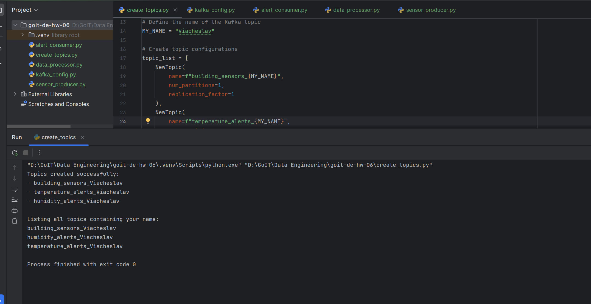
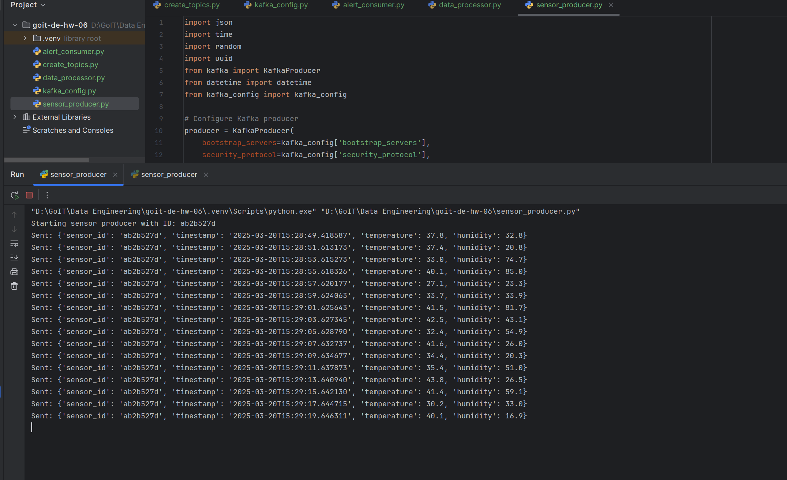
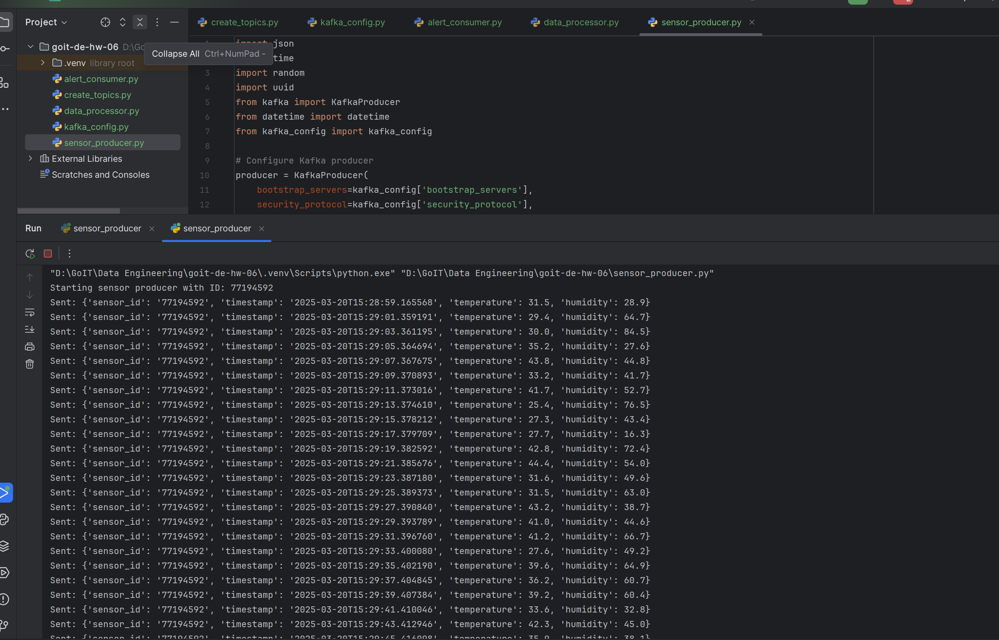
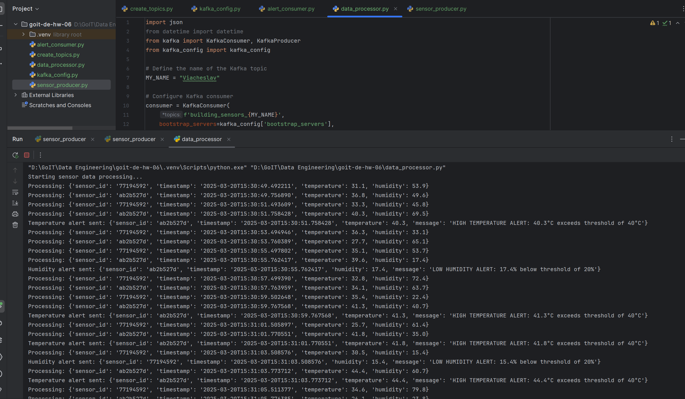
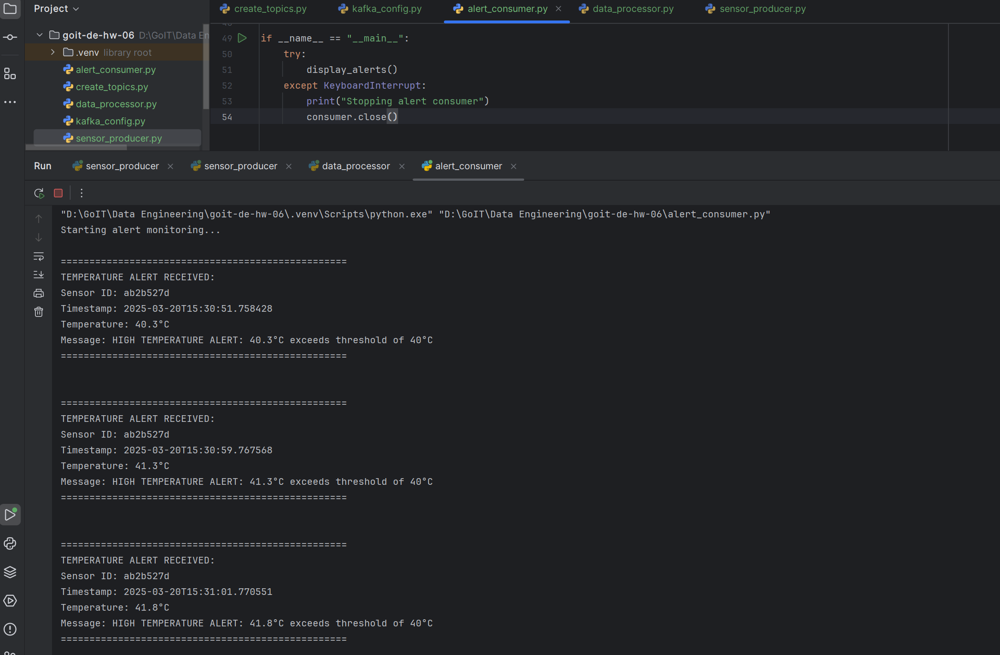

# goit-de-hw-05

## Скрин трьох топіків:

## Скрин генерації даних сенсорів та відправки даних в building_sensors з демонстрацією двох одночасних роботи двох запусків програми:

## Скрин отримання даних та тих даних, що будуть далі використані. Необхідні дані були послані у відповідні топіки:

## Скрин з результатом запису відфільтрованих даних:

