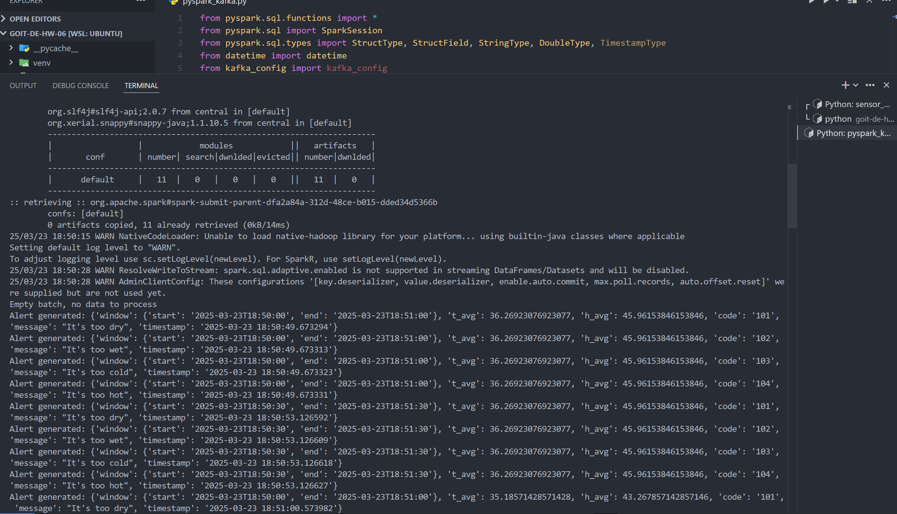

# goit-de-hw-06

## Скрин генерації даних сенсорів та відправки даних в building_sensors з демонстрацією двох (або більше) одночасних роботи двох запусків програми;
 

## Скрин з демонстрацією того, що відфільтровані дані були послані у відповідні топіки.

